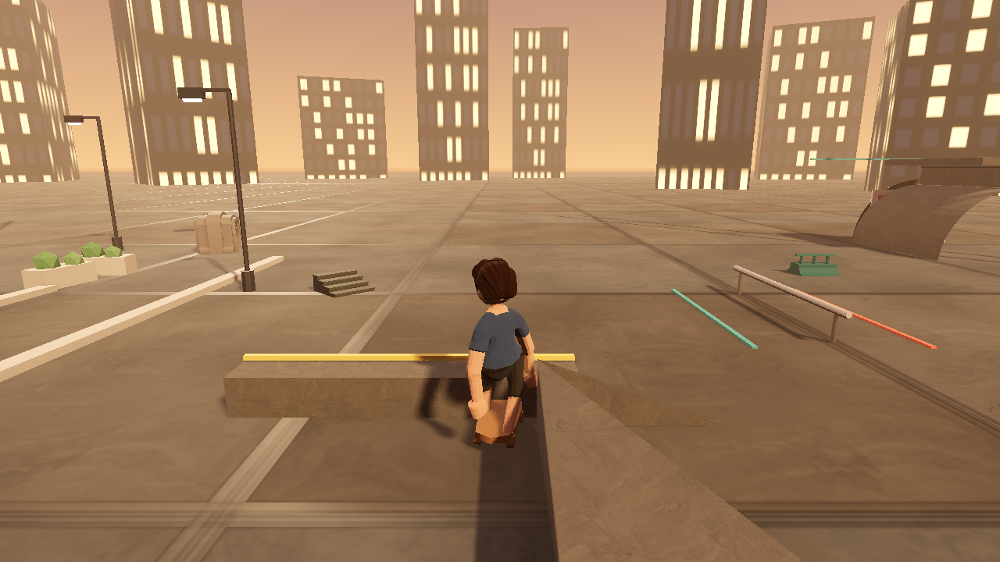

# GRINDLINE

A THPS2-style arcade skating game in a dusk industrial plaza. Godot 4.7,
original code, CC0 art. **100% of the app code was written by an AI builder
agent** running an autonomous loop against mechanical tests — a human wrote the
specs and judged the pixels, and never wrote a line of gameplay code.



This repo is open-sourced as a **worked example of agent-built game dev**: the
game is here, but so is the whole harness — the rules the agent worked under,
the tests that decided pass/fail, the failure log, and an honest account of what
worked and what cost us a day.

---

## Play it

You need [Godot 4.7](https://godotengine.org/download) (4.7.1 recommended — it's
what this was built and verified on). No addons, no build step.

```bash
git clone https://github.com/oh-ashen-one/grindline.git
cd grindline
godot --path .            # runs the game directly
# or: open Godot, "Import" this folder, press F5
```

First launch re-imports the assets (~120 GLB/texture files) and takes a minute.
If you'd rather do it up front: `godot --headless --path . --import`.

### Controls

| Action | Key | Gamepad |
|---|---|---|
| Push | `W` | A / RT |
| Steer | `A` / `D` | left stick |
| Ollie (also hops off a grind) | `Space` | A |
| Dismount — step off, carry the board | `F` | Y |
| Force a bail (debug/feel check) | `B` | — |
| Pause | `Esc` | Start |

### What's actually in it

Being straight with you, because half the value of this repo is the honest
scope line:

- **In:** title screen with a live menu diorama, push/carve locomotion with a
  proper ride stance, ollie (apex ~1.49m, spec'd 1.25–1.56), rail grinds with a
  balance meter and axis lock, bail + combo-loss, a 2:00 run with score /
  combo / multiplier, dismount with board-carry idle, golden-hour lit plaza with
  a hazy tower skyline, street dressing (tram tracks, curbs, drains, lamps,
  palms, planters, benches, murals), CC0 audio.
- **Not in yet:** flip tricks, grabs, manuals, reverts, specials, the character
  roster, S-K-A-T-E objectives, and the results/high-score screen. The trick
  vocabulary is one ollie deep. `BRIEF.md` has the full intended feel table;
  `scripts/ralph/prd.json` has the story board.

It is a vertical slice with a real game feel, not a finished game. Play it for
the push-carve-ollie-grind loop.

---

## How it was made

### The shape of it

A **Ralph loop**: a fresh agent instance per iteration, working exactly one
story from a PRD, where a shell script — not the model's own opinion — decides
whether the story passed.

```
manager (human)          builder agent (ox-alpha)        judge (bash)
─────────────────        ────────────────────────        ────────────
writes BRIEF.md      →   reads prd.json, picks NEXT   →  tests_staged/test_us104.sh
writes the tests         writes ONLY allowedFiles        runs the game headless,
writes prd.json          (≤2 files per story)            asserts measured numbers
reads screenshots    ←   commits on green             ←  pass / fail, no opinions
```

Between iterations the agent's only memory is `prd.json`, `progress.txt`,
`LAST_VERIFY.txt`, `BRIEF.md`, `RULES.md`, and git history. Everything else is
discarded. That constraint is the point: it forces the state of the project into
files a human can read, instead of into a chat log nobody will.

### The parts worth stealing

- **`game/sim/sim_bridge.gd`** (794 lines — the single biggest file here, and it
  isn't game code) is a `SceneTree` script that takes a JSON command list and
  drives the real game: `start`, `seekMs`, `soak` (20× time scale), `input`,
  `teleport`, `assert`, `probe`, `screenshot`. That's how a test can say "push
  for 900ms, ollie, and assert the apex is between 1.25 and 1.56" against the
  actual physics, headless, in ~4 seconds.
- **Pixel probes** — `color_cluster`, `luma_contrast`, `font_region`,
  `ui_min_height` — so *look* has pass/fail criteria too, not just logic. These
  need a **windowed** run; headless lies about pixels.
- **`assets/asset-manifest.json`** — 120 CC0 assets, every one sha256-pinned,
  generated by `tools/build_asset_manifest.py`. The park builder can hide any
  asset id via an env var and substitutes a gray hull with `degraded=true`, so a
  missing file **never** blocks play.
- **`tests_staged/`** — 16 test scripts plus 3 input probes, manager-owned. Rule 2 in `RULES.md` is
  "never edit a test to make it pass," and it is the load-bearing rule of the
  whole thing.

### How long it took

| | |
|---|---|
| Scaffold committed | 2026-08-21 |
| Build sessions | 2026-08-23 (21 commits), 2026-08-24 (18 commits) |
| Wall clock, scaffold → last commit | ~52 hours |
| Actual working time | **two sessions, roughly two days** |
| Commits | 40 — 30 by the builder agent, 10 human (specs, tests, assets) |
| GDScript shipped | 2,087 lines across 14 files |
| Stories green | 15/15 core + US-107 menu flow |

Two days is the honest number for *this* scope, with a human sitting in the
manager seat the whole time — writing stories, staging tests, and looking at
screenshots. It is not a one-prompt result and nobody should sell it as one.

---

## Lessons

### What worked

**1. A mechanical judge beats a model's self-assessment, every time.**
Each story carries a `VERIFY` line — one shell command. The agent doesn't get a
vote. This single design decision is the difference between a working game and a
pile of confident-sounding slop.

**2. Manager-owned tests the builder may not touch.**
An agent that can edit its own tests will edit its own tests. Making
`tests_staged/` off-limits (and enforcing it in the harness, not just in the
prompt) removed an entire class of fake progress.

**3. Small `allowedFiles` per story — two files, max.**
Drift is proportional to write surface. Narrow the surface and a small model
stays on task for hours.

**4. Screenshot, then actually look at it.**
The visual loop was: fix one thing → capture a windowed screenshot through the
sim bridge → open the image and compare it to a reference frame → iterate.
Describing a scene to yourself in text is not seeing it, and an agent that never
looks will happily ship a black screen that passes every logic test.

**5. Degrade, never block.**
Any missing asset becomes a gray hull and a `degraded=true` flag. The game is
always playable, so the loop is never stuck on a download.

**6. Git as memory, `progress.txt` as the lab notebook.**
Every commit is a green story. Every session appends a dated entry with root
causes. Three weeks later, that file is how you know why the sun is a scene node
instead of script-created.

### What hurt

**7. One engine trap ate most of a session.**
On Godot 4.7.1 / macOS, a `DirectionalLight3D` **created from script** with
`shadow_enabled = true` contributes exactly nothing — and with shadows on, the
scene goes black. Env, fog, and unshadowed script lights all work fine, which is
what made it so slow to isolate. The fix: the sun lives in the `.tscn` and the
light rig adopts it. If your lighting is inexplicably flat or dead, check
whether the light was born in a scene file or in code.

**8. The bug that looked like two bugs was one bug, in the last place we looked.**
"Ollie apex collapsed to 0.12m" and "grind latch stopped catching" were reported
as separate physics regressions. Root cause of both: the boundary walls had
swapped box dimensions, leaving a 1×8×48 needle stabbing through the middle of
the field. The test teleport spawned *inside* it, and depenetration shoved the
skater sideways before every measurement. **When two unrelated systems break in
the same session, suspect the shared setup, not the systems.**

**9. Hand-editing a generated file is a silent revert.**
Someone (an agent, then a human) edited `asset-manifest.json` directly. The next
`build_asset_manifest.py` run wiped it. Generated artifacts need to be either
regenerated-only or hand-owned — never both.

**10. Headless is a liar about pixels.**
Logic verified headless is real. Any claim about colour, contrast, layout, or
"does it look right" needs a windowed run and a human eyeball. We learned this
after a "green" visual story shipped a floor that strobed.

**11. Asset pipelines fail quietly and downstream.**
Kenney GLBs lose their colormap on export and render bone-white. Blender models
without `transform_apply` measure as unit cubes. New GLBs are invisible to
`ResourceLoader.exists()` until `godot --headless --path . --import` runs. Every
one of these looks like a game bug and is actually an import bug.

**12. Pose authoring: replace, don't compound.**
Writing animation from Blender Python, set the bone quaternion to the
rest-relative world delta (`rest⁻¹ · world_R · rest`). Multiplying onto the
current pose compounds into 180° flips. Leg bones pivot from the **tail** (feet
stay planted); head-pivot legs sink through the floor — and the debug render
will happily show you a skater standing on nothing.

**13. Three causes, one symptom.**
The "floor seizure" was a second unshadowed sun washing the scene flat, *plus*
prop bottoms exactly coplanar with the floor plane (z-fighting), *plus* a QA
occlusion wall casting a real shadow across the whole field. Fixing any one of
them changed nothing visible, which is exactly why single-cause debugging kept
concluding "no effect, revert."

---

## Repo map

```
game/scenes/main.tscn      entry point (title → run flow)
game/sim/sim_bridge.gd     JSON-driven test/capture harness
scripts/skater/            locomotion, air_state, grind_state, trick_feedback
scripts/camera/            follow cam
scripts/park/              layout_builder — reads the asset manifest, builds the plaza
scripts/run/               run timer, score, combo
scripts/orchestration/     app_flow (phases), run_flow (mount/restart)
tests_staged/              16 manager-owned test scripts + probes (the judge)
scripts/ralph/             prd.json, progress.txt, loop runner, builder brief
assets/                    120 sha256-pinned CC0 assets + manifest
BRIEF.md                   the feel table — every gameplay constant's source
RULES.md                   the contract the builder agent works under
MEGA-PROMPT.md             full handoff: open issues, engine traps, verify loop
ATTRIBUTION.md             every third-party asset and its license
```

Run the test suite:

```bash
bash tests_staged/test_us103_ollie.sh      # one story
for t in tests_staged/test_*.sh; do bash "$t"; done
```

## Credits & license

Code: MIT (see `LICENSE`). All art, audio and textures are **CC0 1.0** —
[Kenney](https://kenney.nl) (Mini Skate, Factory Kit, Input Prompts, impact and
interface sounds, jingles) and [ambientCG](https://ambientcg.com) (PBR texture
sets). Full list with source URLs in `ATTRIBUTION.md`.

The commercial reference frames used during the visual pass are deliberately
**not** distributed with this repo — drop your own into `quality/references/` if
you want to run the side-by-side comparison workflow.

GRINDLINE is an original game and is not affiliated with or endorsed by
Activision or Neversoft. It is described as "THPS-style" only to name a genre.
